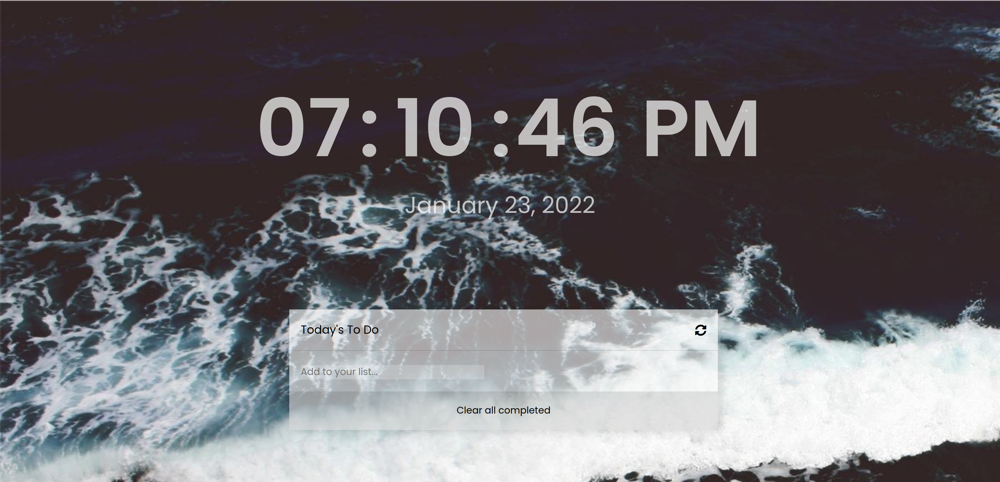

# To do list

> This is a list Application made with javascript with a saving functionality

## Built With

- Major Languages
  - Javascript
  - HTML
- Frameworks
  - Sass
- Technologies used
  - npm
  - webpack

## Live Demo

[Live Demo Link](https://leboroz.github.io/to-do-list/)

## Getting Started

To get a local copy up and running follow these simple example steps.

### Prerequisites

### Setup

### Install

### Usage

### Deployment

## Authors

👤 **Leonardo Albornoz**

- GitHub: [@Leboroz](https://github.com/leboroz)
- Twitter: [@Leboroz](https://twitter.com/leboroz)
- LinkedIn: [LinkedIn](https://www.linkedin.com/in/leonardo-albornoz-216784198/)

## 🤝 Contributing

Contributions, issues, and feature requests are welcome!

Feel free to check the [issues page](https://github.com/leboroz/to-do-list/issues).

## Show your support

Give a ⭐️ if you like this project!

## 📝 License

This project is [MIT](./MIT.md) licensed.
